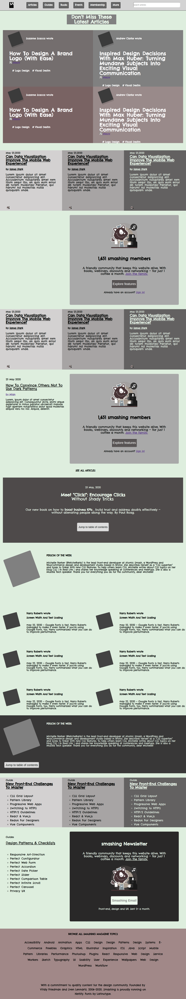

# smashing-magazine-heatmap
Design Teardown of smashing magazine (Microverse Project)

The page shows the design Hierarchy of Smashing Magazine .

## Built With

- Html
- CSS

## Live Demo

[Live Demo Link]()

## Author

👤 **Umair Ahmad**

- Github: [@umairahmad125](https://github.com/UmairAhmad125)
- Linkedin: https://www.linkedin.com/in/talha-waqar-977257145/
- Twitter: [@umairahmadDP](https://twitter.com/umairahmadDP)
- email: (umairahmad125@gmail.com)

## Show your support

Give a ⭐️ if you like this project!

## Acknowledgments

- Project originally taken from The Odin Project
- Project inspired by Microverse Program

